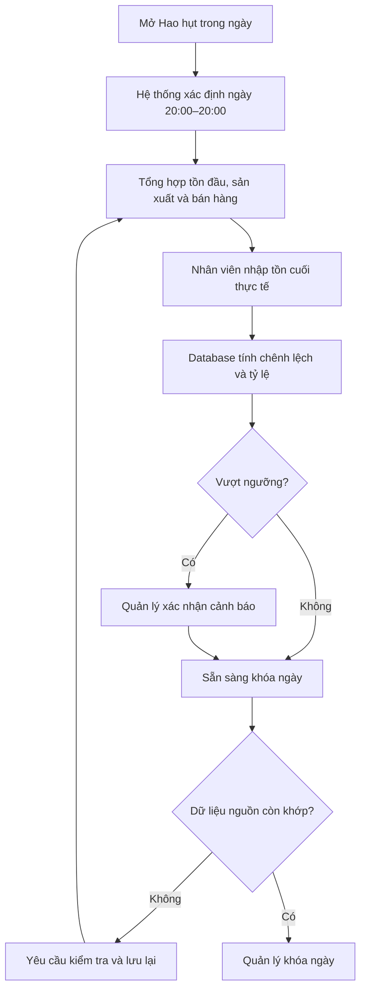

# Thiết kế đối soát hao hụt theo ngày sản xuất

**Ngày:** 2026-09-05
**Trạng thái:** Đã được người dùng duyệt trong phiên brainstorming
**Phạm vi:** Thay chức năng Kiểm kho hiện tại bằng báo cáo hao hụt theo ngày vận hành 20:00–20:00

## 1. Mục tiêu

Hệ thống cần giúp xưởng nước đá xác định lượng thành phẩm không giải trình được trong mỗi ngày sản xuất bằng cách cân đối tồn đầu, sản lượng, lượng bán và tồn cuối thực tế.

Chức năng mới phải:

- Dùng một ngày vận hành thống nhất cho toàn hệ thống.
- Tự tổng hợp sản lượng và số bao bán ra, không yêu cầu nhập lại.
- Cho nhân viên nhập tồn cuối nhanh trên điện thoại hoặc máy tính.
- Phân biệt rõ khớp kho, hao hụt và dư kho.
- Cảnh báo khi chênh lệch vượt ngưỡng.
- Lưu đầy đủ phiên bản chỉnh sửa và người thực hiện.
- Chặn khóa ngày khi dữ liệu chưa đầy đủ hoặc báo cáo đã lỗi thời.
- Giữ nguyên dữ liệu kiểm kho cũ để tra cứu kỹ thuật nhưng không sử dụng trong nghiệp vụ mới.

## 2. Ngoài phạm vi

- Không quản lý nhiều loại thành phẩm hoặc nhiều đơn vị tính; toàn bộ số lượng vẫn tính theo bao.
- Không có nghiệp vụ xuất khác như cho/tặng, dùng nội bộ hoặc chủ động loại bỏ hàng hỏng.
- Không tự động diễn giải chênh lệch là đá tan; kết quả chỉ thể hiện số bao chưa được giải trình.
- Không chuyển đổi các bản kiểm kho cũ thành báo cáo hao hụt.
- Không tự động khóa ngày lúc 20:00.

## 3. Ngày vận hành thống nhất

Toàn bộ hệ thống dùng múi giờ `Asia/Bangkok` và cùng một quy tắc ngày vận hành:

```text
Ngày D = [20:00 ngày D, 20:00 ngày D+1)
```

Sự kiện xảy ra đúng 20:00 thuộc ngày vận hành mới. Ví dụ, ngày vận hành `2026-09-05` bắt đầu lúc `2026-09-05 20:00:00` và kết thúc ngay trước `2026-09-06 20:00:00`.

Quy tắc này áp dụng cho:

- Bắt đầu máy, Xả đá, Tắt máy và số bao của lần xả.
- Bán sỉ, bán lẻ và doanh thu.
- Thu tiền và công nợ.
- Chi phí.
- Tồn cuối, báo cáo hao hụt và khóa sổ.

Các biểu mẫu giao dịch mặc định dùng thời gian hiện tại để nhập nhanh. Người dùng có thể mở phần thời gian và chọn thời điểm thực tế khi nhập muộn. Hệ thống tự suy ra ngày vận hành; người dùng không tự chọn ngày. Sửa thời gian phải được ghi lịch sử và không được chuyển dữ liệu vào ngày đã khóa.

## 4. Mốc chuyển đổi

Quy tắc 20:00–20:00 chỉ áp dụng từ một thời điểm triển khai được cấu hình rõ ràng.

- Dữ liệu trước mốc giữ nguyên ngày vận hành đã lưu theo quy tắc cũ.
- Không tự động đổi ngày hoặc tính lại báo cáo lịch sử.
- Ngày vận hành đầu tiên sau mốc yêu cầu nhập tồn đầu thủ công.
- Môi trường Dev có thể xóa dữ liệu thử nghiệm và seed lại để kiểm thử từ đầu.

## 5. Nguồn dữ liệu

### 5.1. Tổng sản xuất

Tổng sản xuất là tổng số bao đã nhập cho các lần Xả đá có thời điểm xả nằm trong ngày vận hành.

- Ngày sản xuất được xác định bằng thời điểm Xả đá, không phải thời điểm nhập số bao.
- Nhập số bao sau đó không làm thay đổi ngày của lần xả.
- Lần xả chưa có số bao được đánh dấu chưa hoàn tất.
- Ngày không thể khóa khi vẫn còn lần xả chưa có số bao.

### 5.2. Tổng bán

Tổng bán là tổng số bao trong các đơn bán sỉ và bán lẻ đang hoạt động, có thời gian bán thực tế nằm trong ngày vận hành.

- Tính toàn bộ số bao đã bán, không phụ thuộc đã thu tiền hay còn công nợ.
- Không tính đơn đã hủy.
- Nếu đơn bị hủy hoặc sửa trước khi khóa ngày, báo cáo hao hụt liên quan trở nên lỗi thời và phải được xác nhận lại.

### 5.3. Tồn đầu

- Tồn đầu của một ngày tự động lấy từ tồn cuối đã khóa của ngày liền trước.
- Ngày đầu tiên sau mốc chuyển đổi cho phép nhập tồn đầu thủ công.
- Nếu ngày trước chưa có tồn cuối chính thức hoặc chưa khóa, ngày tiếp theo vẫn có thể nhận giao dịch mới nhưng chưa thể hoàn tất báo cáo hao hụt.

### 5.4. Tồn cuối

- Tồn cuối là số bao thực tế được đếm gần thời điểm 20:00.
- Mỗi ngày có một kết quả tồn cuối hiện hành.
- Mọi người dùng đang hoạt động có thể nhập hoặc sửa trước khi khóa ngày.
- Ghi chú là tùy chọn.
- Sau khi ngày bị khóa, tồn cuối không thể sửa cho đến khi quản lý mở khóa ngày theo cơ chế hiện có.

## 6. Công thức và phân loại

```text
Chênh lệch = Tồn đầu + Tổng sản xuất - Tổng bán - Tồn cuối
```

Khi Tổng sản xuất lớn hơn 0:

```text
Tỷ lệ chênh lệch = |Chênh lệch| / Tổng sản xuất × 100
```

Phân loại:

- `Chênh lệch > 0`: Hao hụt.
- `Chênh lệch = 0`: Khớp kho.
- `Chênh lệch < 0`: Dư kho; hiển thị trị tuyệt đối của số bao dư, không hiển thị “hao hụt âm”.

Khi Tổng sản xuất bằng 0:

- Nếu số liệu vẫn cân bằng, hiển thị “Không phát sinh sản xuất”.
- Nếu không cân bằng, hiển thị số bao chênh lệch, không hiển thị phần trăm và đánh dấu cần kiểm tra.
- Không dùng `0%` thay cho tỷ lệ không xác định.

Chênh lệch chỉ phản ánh lượng thành phẩm chưa được giải trình. Nó có thể đến từ hao hụt vật lý, sai số đếm hoặc dữ liệu sản xuất/bán hàng chưa chính xác.

## 7. Ngưỡng cảnh báo

Hệ thống dùng một ngưỡng chênh lệch có thể cấu hình, mặc định `5%`.

- Chênh lệch không vượt ngưỡng: lưu và hiển thị trạng thái bình thường.
- Chênh lệch vượt ngưỡng: cảnh báo đỏ và đánh dấu `Cần kiểm tra`.
- Kết quả vượt ngưỡng vẫn được lưu.
- Chỉ quản lý có thể xác nhận cảnh báo để khóa ngày.
- Không bắt buộc nhập lý do xác nhận.
- Hệ thống lưu người xác nhận và thời gian.
- Nếu dữ liệu nguồn hoặc tồn cuối thay đổi, xác nhận cũ hết hiệu lực.

## 8. Mô hình dữ liệu mới

Tạo một thực thể báo cáo hao hụt theo ngày, tách biệt với `stock_counts` và `inventory_ledger` cũ.

Một báo cáo hiện hành cần lưu tối thiểu:

- Ngày vận hành, duy nhất trên mỗi ngày.
- Tồn đầu.
- Tổng sản xuất tại lần tính gần nhất.
- Tổng bán tại lần tính gần nhất.
- Tồn cuối thực tế.
- Chênh lệch có dấu.
- Tỷ lệ chênh lệch nullable.
- Phân loại `matched`, `loss`, `surplus` hoặc `no_production`.
- Ngưỡng cảnh báo tại thời điểm tính.
- Cờ cần kiểm tra.
- Trạng thái dữ liệu nguồn hiện hành/lỗi thời.
- Phiên bản, người tạo, người cập nhật và các mốc thời gian.
- Người xác nhận cảnh báo và thời gian xác nhận, nếu có.

Mỗi lần lưu tồn cuối, database phải khóa phạm vi ngày cần tính, đọc lại các nguồn, tính toàn bộ kết quả trong cùng một giao dịch và ghi một phiên bản lịch sử bất biến. Báo cáo hiện hành có thể cập nhật trước khi khóa ngày, nhưng phiên bản trước không bị mất.

Các bảng `stock_counts` và `inventory_ledger` hiện tại được giữ nguyên trong giai đoạn đầu, ẩn khỏi giao diện và không tham gia công thức mới. Việc xóa chúng, nếu cần, sẽ là một migration riêng sau khi chức năng mới vận hành ổn định.

## 9. Phát hiện báo cáo lỗi thời

Báo cáo lưu một ảnh chụp các tổng số nguồn tại thời điểm nhập tồn cuối. Nếu sản lượng, số bao của lần xả, giao dịch bán hoặc trạng thái hủy đơn thay đổi sau đó:

- Màn hình hiển thị `Số liệu đã thay đổi`.
- Kết quả cảnh báo đã xác nhận trước đó hết hiệu lực.
- Khóa ngày bị chặn.
- Người dùng phải kiểm tra tồn cuối và lưu lại báo cáo bằng dữ liệu mới.

Quy trình khóa ngày luôn tổng hợp lại nguồn một lần cuối và so sánh với ảnh chụp đã lưu; không chỉ tin vào dữ liệu trên giao diện.

## 10. Đồng thời và tính toàn vẹn

- RPC lưu báo cáo phải có idempotency key để thao tác lặp do mạng chậm không tạo bản ghi trùng.
- Cập nhật dùng số phiên bản kỳ vọng; nếu người khác đã sửa, trả lỗi xung đột và yêu cầu tải lại.
- Database kiểm tra ngày chưa khóa, quyền người dùng và ranh giới thời gian.
- Không dựa riêng vào kiểm tra phía trình duyệt.
- Lịch sử phiên bản và audit log không cho phép người dùng thường sửa hoặc xóa.

## 11. Luồng người dùng



Hệ thống tự chuyển sang ngày vận hành mới lúc 20:00 nhưng không tự khóa ngày cũ. Nhân viên vẫn nhập dữ liệu cho ngày mới trong khi ngày trước chờ xử lý. Quản lý thấy cảnh báo thường trực cho đến khi ngày cũ được khóa.

## 12. Giao diện

Thay mục `Tồn kho/Kiểm kho` bằng `Hao hụt trong ngày`.

Màn hình ngày hiện tại hiển thị:

```text
Tồn đầu
+ Tổng sản xuất
- Tổng bán
= Tồn cuối dự kiến
```

Sau đó hiển thị:

- Ô `Tồn cuối thực tế`.
- Ghi chú tùy chọn.
- Số bao hao hụt hoặc dư.
- Tỷ lệ và ngưỡng cảnh báo.
- Trạng thái dữ liệu nguồn.
- Nút `Lưu kết quả cuối ngày`.

Quy ước hiển thị:

- Xanh lá: khớp kho.
- Vàng: có chênh lệch nhưng chưa vượt ngưỡng.
- Đỏ: vượt ngưỡng hoặc dữ liệu cần kiểm tra.
- Trạng thái chữ luôn ghi rõ `Hao hụt`, `Dư kho`, `Khớp kho` hoặc `Không phát sinh sản xuất`; không chỉ dựa vào màu.

Màn hình lịch sử hiển thị theo ngày: tồn đầu, sản xuất, bán, tồn cuối, chênh lệch và tỷ lệ. Quản lý có thể mở lịch sử chỉnh sửa để xem người sửa, thời gian và giá trị trước/sau.

Trên điện thoại dùng thẻ và nút chạm lớn; trên máy tính dùng bảng tổng hợp đầy đủ.

## 13. Khóa ngày và quyền hạn

Quản lý khóa ngày thủ công. Trước khi khóa, hệ thống chặn khi:

- Chưa có tồn cuối.
- Ngày trước chưa được hoàn tất nên không xác định được tồn đầu.
- Có lần Xả đá chưa nhập số bao.
- Báo cáo hao hụt đã lỗi thời.
- Chênh lệch vượt ngưỡng nhưng chưa được quản lý xác nhận.
- Còn các điều kiện khóa ngày hiện có chưa được xử lý.

Mọi người dùng đang hoạt động có thể nhập hoặc sửa tồn cuối trước khi khóa. Chỉ quản lý được xác nhận cảnh báo, khóa ngày, mở khóa và xem đầy đủ lịch sử chỉnh sửa.

## 14. Kiểm thử bắt buộc

### 14.1. Đơn vị

- Ánh xạ `19:59:59` và `20:00:00` vào đúng ngày vận hành.
- Công thức hao hụt dương, khớp kho và dư kho.
- Tổng sản xuất bằng 0 với dữ liệu cân bằng và không cân bằng.
- So sánh ngưỡng chính xác tại và trên `5%`.

### 14.2. Tích hợp database

- Tổng hợp số bao theo thời điểm Xả đá dù số lượng được nhập muộn.
- Tổng hợp bán sỉ/lẻ không phụ thuộc trạng thái thanh toán.
- Loại đơn hủy và làm báo cáo liên quan lỗi thời.
- Kế thừa tồn cuối đã khóa sang tồn đầu ngày sau.
- Chặn hoàn tất ngày khi ngày trước chưa khóa.
- Lưu phiên bản và audit trước/sau.
- Từ chối ghi vào ngày đã khóa.
- Phát hiện xung đột khi hai người sửa đồng thời.
- Idempotency không tạo phiên bản trùng.
- Xác nhận cảnh báo bị vô hiệu khi dữ liệu thay đổi.

### 14.3. End-to-end

- Nhập nhanh bằng giờ hiện tại trên điện thoại.
- Nhập muộn bằng thời gian thực tế và tự xác định đúng ngày.
- Luồng Xả đá → nhập số bao → bán hàng → nhập tồn cuối → khóa ngày.
- Trạng thái màu và nội dung có thể hiểu được không cần dựa vào màu.
- Quản lý xem lịch sử chỉnh sửa và xác nhận cảnh báo.
- Dữ liệu trước mốc chuyển đổi không bị thay đổi.

## 15. Triển khai

1. Áp dụng migration và seed thử nghiệm vào Supabase Dev.
2. Chạy unit, integration và E2E trên nhánh `dev`.
3. Deploy Vercel Preview dùng Supabase Dev.
4. Kiểm tra luồng thực tế trên điện thoại và máy tính.
5. Chọn thời điểm chuyển đổi Production tại một mốc 20:00.
6. Áp dụng migration Production, cấu hình mốc chuyển đổi và nhập tồn đầu ngày đầu tiên.
7. Theo dõi ít nhất một chu kỳ 20:00–20:00 trước khi coi quá trình chuyển đổi hoàn tất.

## 16. Tiêu chí hoàn thành

- Tất cả module dùng cùng ngày vận hành 20:00–20:00 từ mốc chuyển đổi.
- Báo cáo dùng đúng công thức đã duyệt và không cho nhập tay tổng sản xuất/tổng bán.
- Tồn đầu kế thừa chính xác; ngày đầu hỗ trợ khởi tạo thủ công.
- Chênh lệch âm được hiển thị là dư kho, không phải hao hụt âm.
- Ngày không sản xuất không hiển thị phần trăm sai lệch giả.
- Báo cáo nguồn thay đổi không thể khóa cho đến khi được lưu lại.
- Cảnh báo vượt ngưỡng chỉ được quản lý xác nhận.
- Lịch sử chỉnh sửa và thao tác khóa ngày đầy đủ.
- Dữ liệu lịch sử trước mốc và bảng kiểm kho cũ không bị tự động sửa.
