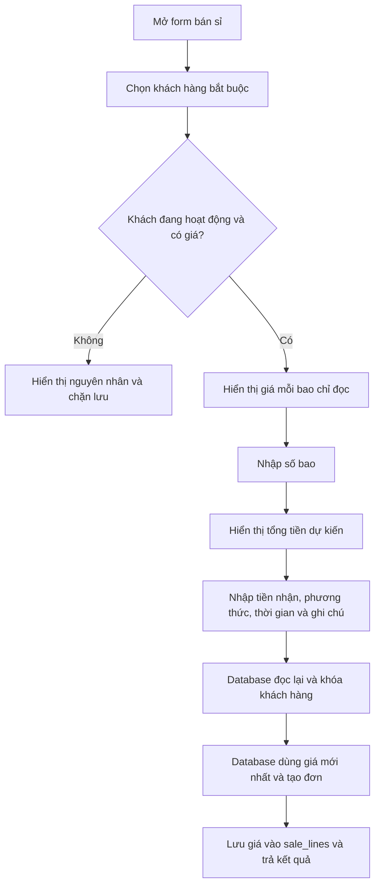

# Thiết kế giá sỉ mặc định theo khách hàng

**Ngày:** 2026-09-09  
**Trạng thái:** Đã được người dùng duyệt trong phiên brainstorming  
**Phạm vi:** Danh mục khách hàng, nhập bán sỉ, công nợ, audit và báo cáo liên quan

## 1. Mục tiêu

Mỗi khách hàng đầu mối có một giá sỉ mặc định theo bao. Khi nhập bán sỉ thông thường, nhân viên chỉ chọn khách hàng và nhập số bao; hệ thống tự lấy giá hiện hành, tính tổng tiền và lưu giá đã dùng vào đơn.

Thiết kế phải bảo đảm:

- Mọi đơn bán sỉ đều gắn với một khách hàng.
- Giá bán sỉ thông thường không do nhân viên nhập và không thể bị giả mạo từ trình duyệt.
- Giá đã dùng trong đơn cũ không thay đổi khi giá mặc định của khách hàng thay đổi.
- Quản lý có thể nhập giá thực tế khi nhập bù một đơn thuộc ngày vận hành cũ.
- Thay đổi giá khách hàng và việc sử dụng giá nhập bù đều có thể truy vết.
- Luồng bán lẻ tiếp tục cho phép nhập giá thủ công như hiện tại.

## 2. Quyết định nghiệp vụ

- Thành phẩm chỉ tính theo `bao`.
- Mỗi khách hàng có một giá sỉ mặc định tại một thời điểm.
- Khách hàng là bắt buộc đối với mọi đơn bán sỉ, kể cả đơn đã thanh toán đủ.
- Đơn bán sỉ thông thường chỉ có một ô số lượng bao; không dùng nhiều dòng giá.
- Giá sỉ mặc định là số nguyên VNĐ lớn hơn 0.
- Giá mới chỉ áp dụng cho đơn được tạo sau khi cập nhật.
- `sale_lines.unit_price_vnd` tiếp tục là bản chụp giá tại thời điểm bán.
- Chỉ quản lý được tạo/sửa khách hàng và thay đổi giá sỉ.
- Chỉ quản lý được nhập giá riêng cho đơn bán bù của ngày vận hành trong quá khứ.
- Giá nhập bù chỉ áp dụng cho đơn đó, không cập nhật giá mặc định của khách hàng.

## 3. Mô hình dữ liệu

Thêm cột nullable vào `public.customers`:

```text
wholesale_unit_price_vnd bigint null
```

Ràng buộc database yêu cầu giá phải lớn hơn 0 khi có giá trị. Cột ban đầu nullable để migration không làm hỏng các khách hàng hiện có.

Quy tắc sử dụng:

- Khách hàng mới: ứng dụng và RPC bắt buộc nhận giá hợp lệ.
- Khách hàng cũ có giá `NULL`: vẫn tồn tại và có thể chỉnh sửa, nhưng không đủ điều kiện bán sỉ.
- Khách hàng ngừng hoạt động: không đủ điều kiện bán sỉ.
- Không cập nhật ngược các dòng bán hàng cũ khi giá khách hàng thay đổi.

Không cần bảng lịch sử giá riêng trong phạm vi này. `audit_log` hiện có lưu toàn bộ `before_data` và `after_data` của khách hàng, bao gồm giá cũ và giá mới.

## 4. Cập nhật danh mục khách hàng

RPC quản lý khách hàng được mở rộng để nhận giá sỉ mặc định.

Khi tạo mới:

- Kiểm tra người gọi là quản lý đang hoạt động.
- Chuẩn hóa các trường hiện có.
- Từ chối nếu giá không phải số nguyên dương.
- Tạo khách hàng và ghi audit `customer.created`.

Khi chỉnh sửa:

- Khóa bản ghi khách hàng trong giao dịch.
- Từ chối nếu khách hàng không tồn tại hoặc giá không hợp lệ.
- Cập nhật hồ sơ và giá.
- Ghi audit `customer.updated` với dữ liệu trước/sau.

Giao diện tạo/sửa khách hàng thêm trường bắt buộc `Giá sỉ mỗi bao (VNĐ)`. Khi sửa giá, giao diện hiển thị lưu ý rằng giá mới không ảnh hưởng các đơn đã lưu.

Danh sách khách hàng hiển thị:

- Giá hiện tại theo định dạng VNĐ; hoặc
- Nhãn `Chưa thiết lập giá sỉ` đối với dữ liệu cũ.

## 5. Luồng bán sỉ thông thường



Form bán sỉ gồm:

- Khách hàng đầu mối, bắt buộc.
- Giá sỉ mỗi bao, chỉ đọc.
- Số lượng bao, số nguyên dương.
- Tổng giá trị đơn, tự tính để xem trước.
- Tiền nhận ngay.
- Phương thức thanh toán.
- Thời gian phát sinh.
- Ghi chú tùy chọn.

Frontend chỉ dùng giá khách hàng để hiển thị dự kiến. Database là nguồn quyết định cuối cùng. Kết quả RPC phải trả về giá và tổng tiền thực tế đã lưu để giao diện không xác nhận một con số cũ.

Nếu giá thay đổi sau khi form được mở, database sử dụng giá mới nhất. Giao diện thông báo rằng giá vừa thay đổi và hiển thị tổng tiền thực tế.

## 6. Luồng nhập bù bán sỉ

“Ngày cũ” được xác định theo ngày vận hành `[20:00 ngày D, 20:00 ngày D+1)`, múi giờ `Asia/Bangkok`.

Khi thời gian phát sinh thuộc một ngày vận hành trước ngày vận hành hiện tại:

- Quản lý thấy thêm trường `Giá sỉ thực tế mỗi bao`.
- Giá này bắt buộc là số nguyên dương.
- Database dùng giá nhập bù thay cho giá mặc định và lưu giá đó vào `sale_lines`.
- Giá mặc định của khách hàng không thay đổi.
- Audit của đơn phải thể hiện đây là giao dịch nhập bù và giá thực tế đã dùng.

Database chỉ chấp nhận giá nhập bù khi:

- Người gọi là quản lý đang hoạt động.
- Thời gian thuộc ngày vận hành trong quá khứ.
- Thời gian không nằm trước mốc cutover được cấu hình.
- Ngày vận hành tồn tại hoặc được tạo theo quy tắc hiện hành và chưa khóa.
- Khách hàng tồn tại và đang hoạt động.
- Giá nhập bù hợp lệ.

Nhân viên không được phép dùng giá nhập bù. Đơn thuộc ngày vận hành hiện tại luôn dùng giá mặc định, kể cả khi request cố gửi một giá khác.

## 7. Bảo vệ tại database

RPC tạo đơn là ranh giới tin cậy và phải thực hiện trong một giao dịch:

1. Xác thực người dùng đang hoạt động.
2. Xác định ngày vận hành từ thời gian phát sinh.
3. Kiểm tra cutover và trạng thái khóa ngày.
4. Với đơn bán sỉ, yêu cầu `customer_id` và khóa bản ghi khách hàng bằng `FOR UPDATE`.
5. Kiểm tra khách hàng đang hoạt động.
6. Chọn giá hợp lệ:
   - Giá mặc định hiện hành cho đơn thông thường.
   - Giá nhập bù cho quản lý khi đáp ứng đủ điều kiện.
7. Tự tạo một dòng bán hàng với số bao và giá đã chọn.
8. Tính tổng tiền, kiểm tra tiền nhận không vượt tổng và tạo công nợ nếu cần.
9. Lưu audit và hoàn tất idempotency trong cùng giao dịch.

Giá do client gửi cho đơn thông thường phải bị bỏ qua hoặc bị từ chối; không được dùng làm nguồn tính tiền.

Các hàm `SECURITY DEFINER` tiếp tục phải:

- Đặt `search_path = ''`.
- Tự kiểm tra `auth.uid()` và quyền nghiệp vụ.
- Bị `REVOKE` khỏi `PUBLIC`/`anon` và chỉ `GRANT EXECUTE` cho vai trò cần thiết.

## 8. Validation và thông báo

Thông báo nghiệp vụ tối thiểu:

- `Khách hàng là bắt buộc đối với đơn bán sỉ.`
- `Khách hàng chưa được thiết lập giá sỉ.`
- `Khách hàng đã ngừng hoạt động.`
- `Giá sỉ phải là số nguyên lớn hơn 0.`
- `Chỉ quản lý được nhập giá cho đơn bán bù.`
- `Giá nhập bù chỉ áp dụng cho ngày vận hành trong quá khứ.`
- `Ngày vận hành đã khóa sổ.`
- `Giá khách hàng vừa thay đổi; đơn đã được tính theo giá mới nhất.`

Frontend kiểm tra sớm để cải thiện trải nghiệm, nhưng mọi điều kiện quan trọng phải được kiểm tra lại trong database.

## 9. Tương thích với các module hiện có

- Bán lẻ giữ cấu trúc nhiều dòng và nhập giá thủ công như hiện tại.
- Bán sỉ chuyển thành một số lượng bao và một giá do database chọn.
- `sale_lines` tiếp tục là nguồn số lượng và giá lịch sử cho báo cáo.
- Doanh thu, công nợ và báo cáo không đọc giá hiện hành từ `customers`; chúng đọc giá đã chụp trong đơn.
- Báo cáo hao hụt tiếp tục cộng số bao bán sỉ/lẻ từ các đơn hợp lệ; thay đổi này không đổi công thức hao hụt.
- Hủy đơn, idempotency và quy tắc ngày vận hành tiếp tục hoạt động như hiện tại.

## 10. Kiểm thử bắt buộc

### 10.1. Đơn vị và component

- Schema khách hàng chấp nhận giá nguyên dương và từ chối giá trống, bằng 0, âm hoặc không nguyên.
- Form khách hàng gửi và hiển thị đúng giá.
- Form bán sỉ bắt buộc chọn khách hàng.
- Chọn khách có giá hiển thị giá chỉ đọc và tính đúng tổng dự kiến.
- Khách chưa có giá hiển thị trạng thái rõ ràng và bị chặn lưu.
- Form bán sỉ chỉ có một ô số bao.
- Bán lẻ vẫn nhập được giá và nhiều dòng như trước.
- Trường giá nhập bù chỉ xuất hiện cho quản lý với thời gian thuộc ngày cũ.

### 10.2. Tích hợp database

- Tạo/sửa khách hàng lưu giá và ghi audit trước/sau.
- Đơn thông thường dùng giá trong database dù payload bị sửa.
- Giá thay đổi đồng thời được xử lý bằng giá mới nhất đã khóa trong giao dịch.
- Đổi giá khách hàng không sửa `sale_lines` cũ.
- Khách `NULL` giá hoặc ngừng hoạt động bị từ chối.
- Nhân viên không thể gửi giá nhập bù.
- Quản lý nhập bù ngày cũ với giá riêng thành công.
- Giá nhập bù không thay đổi hồ sơ khách hàng.
- Ngày hiện tại, ngày đã khóa và thời gian trước cutover từ chối override giá.
- Tổng tiền, tiền nhận, khoản phải thu và audit được tạo nguyên tử.
- Gửi lại cùng idempotency key không tạo đơn trùng.

### 10.3. End-to-end

- Quản lý tạo khách hàng kèm giá sỉ.
- Nhân viên chọn khách, nhập số bao và hoàn tất đơn không cần nhập giá.
- Tổng tiền và công nợ hiển thị đúng.
- Quản lý cập nhật giá rồi tạo đơn mới với giá mới; đơn cũ giữ giá cũ.
- Quản lý nhập bù đơn ngày cũ bằng giá ghi trong sổ tay.
- Thông báo lỗi có nguyên nhân rõ ràng trên điện thoại và máy tính.

## 11. Triển khai

1. Tạo migration và cập nhật mã nguồn trên nhánh `dev`.
2. Áp migration lên Supabase Dev.
3. Với khách hàng Dev hiện có, để giá `NULL` nhằm kiểm tra trạng thái chuyển tiếp, sau đó quản lý cập nhật qua giao diện.
4. Chạy unit test, integration test, E2E, lint và production build.
5. Deploy Vercel Preview kết nối Supabase Dev.
6. Kiểm tra thủ công trên điện thoại và máy tính.
7. Sau khi người dùng duyệt, merge vào `main` và áp migration Production.
8. Trước khi vận hành Production, quản lý thiết lập giá cho mọi khách hàng đang hoạt động cần bán sỉ.

## 12. Tiêu chí hoàn thành

- Khách hàng mới luôn có giá sỉ mặc định hợp lệ.
- Mọi đơn bán sỉ luôn gắn khách hàng.
- Nhân viên không nhập hoặc giả mạo được giá bán sỉ thông thường.
- Database là nguồn quyết định giá cuối cùng.
- Đơn cũ giữ nguyên giá sau khi giá khách hàng thay đổi.
- Quản lý nhập bù được giá thực tế cho ngày cũ nhưng không làm đổi giá mặc định.
- Lịch sử thay đổi giá và giao dịch nhập bù có thể truy vết.
- Bán lẻ, doanh thu, công nợ và hao hụt không bị hồi quy.
- Toàn bộ kiểm thử và build vượt qua trên nhánh `dev` trước khi triển khai Production.
